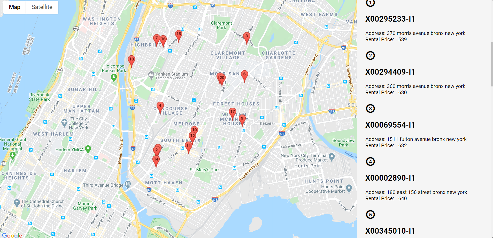
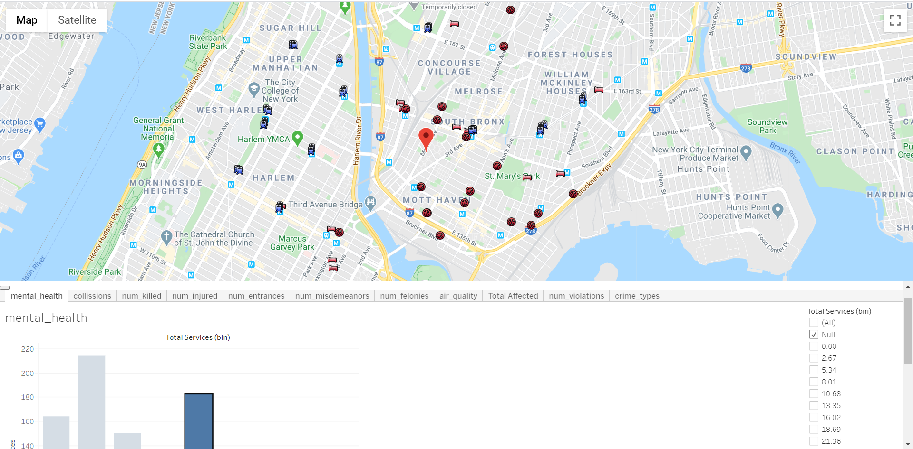

# Housing-Insight

The goal of this project is to build a data pipeline that allows homebuyers and renters to to gain access to detailed information about potential houses and neighborhoods they are considering, so that they can make more informed decisions on where they want to live.

# Table of Contents
1. 
2. 
3. 
4. 
5. 
6. 
7. 

# Motivation

Placeholder text....

# Pipeline

Placeholder text....

# Requirements
Placeholder text....

# Architecture

Placeholder text....

# Dataset

Placeholder text....

# File Structure

Placeholder text....

# Methodology

Placeholder text....

