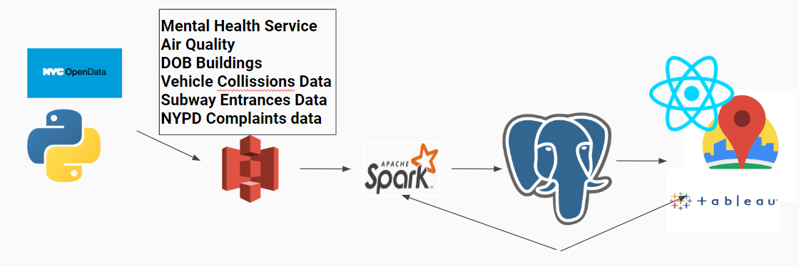

WIP

# Living-Insight

The goal of this project is to build a data pipeline that allows homebuyers and renters to to gain access to detailed information about potential houses and neighborhoods they are considering, so that they can make more informed decisions on where they want to live.


#### Youtube Video Preview
[](https://www.youtube.com/watch?v=uXKn49dwoII&t=3s)


# Table of Contents
  * [Motivation](#motivation)
  * [Pipeline](#pipeline)
  * [Requirements](#requirements)
  * [Architecture](#architecture)
  * [Dataset](#dataset)
  * [File Structure](#file-structure)
  * [Methodology](#methodology)


## Motivation

Many people, when buying homes often focus on the price, or at the very most, the price and hearsay from friends and neighbors, they never really search for insight into a specific neighborhood or place, and part of the reason for that is due to the large variety of data, and disjointed it is. Living-Insight solves this problem by creating a data pipeline that connects its users to all of this data.


## Pipeline


## Requirements
Python 3  
Ubuntu  
PySpark  

## Architecture

##### Files from NYC Opendata -> S3
Files Uploaded into S3 either manually through the AWS console, or using [uploadcsvs.py](uploadcsvs.py)

##### Files Stored from S3 processed into -> Spark -> Processed Data stored into PostgreSQL
[Process_datasets](https://github.com/JUCHY/Living-Insight/tree/master/process_datasets) contains the python scripts used to match the different datasets to specific buildings and locations. This data is also then uploaded into postgresql using the JDBC driver

##### Data from PostgreSQL -> Accessed by NodeExpress API
[Queries.js](node-postgres-api/queries.js) contains the API calls that provides the data that is visualized with the frontend
API also accepts in new data, using javascripts exec api to run a [spark job](https://github.com/JUCHY/Living-Insight/blob/master/process_datasets/integrate_data.py) and [SQL Script](https://github.com/JUCHY/Living-Insight/blob/master/process_datasets/integrate_data.sql) from the command line.

##### Front-End -> Created using ReactJS in Conjunction with Tableau for table visualization, and Google Maps API for displaying location of data points
[React](https://reactjs.org/docs/create-a-new-react-app.html) is used for the dynamic rendering of data points displayed using the [Google Maps Api](https://www.npmjs.com/package/react-google-maps). Clicking a datapoint reveals a more detailed view of that data. A [tableau](https://www.tableau.com/) visualization is dynamically rendered at the bottom of the webapp. The tableau visualization conencts to a tableau workbook craeted usnig the tableau desktop app, and stored onto the tableau online server.

### Spark
[Create cluster of EC2 instances](https://blog.insightdatascience.com/create-a-cluster-of-instances-on-aws-899a9dc5e4d0)  
[Install spark onto cluster](https://blog.insightdatascience.com/simply-install-spark-cluster-mode-341843a52b88)  
[Download JDBC for handling connection PSQL database](https://jdbc.postgresql.org/download.html)  
Install necceessary python modules:
```
pip install fastkml
pip install gmpy2
```
Submit Python Script:
```
spark-submit --packages com.amazonaws:aws-java-sdk:1.7.4,org.apache.hadoop:hadoop-aws:2.7.7 --master spark://ec2-52-91-13-65.compute-1.amazonaws.com:7077 --driver-class-path /home/ubuntu/postgresql-42.2.14.jar {Path/to/Script} {command_line_args if any}
```

### PostgreSQL
[Installation](https://blog.insightdatascience.com/simply-install-postgresql-58c1e4ebf252)  
Connect to database and create user  
```
sudo -u postgres -i
psql
CREATE USER <set_username> WITH PASSWORD '<setpassword>';

```

### Node.js and Express
[Install Node.js](https://github.com/nodesource/distributions/blob/master/README.md#debinstall)  
Run:  
```
mkdir node-api-postgres
cd node-api-postgres
npm init -y
npm i express pg

```

### ReactJS
Run   
```
npx create-react-app my-app
cd my-app
npm install react-google-maps --save
```
Edit index.html in public to include script for [tableau javascript api](https://help.tableau.com/current/api/js_api/en-us/JavaScriptAPI/js_api.htm)  

### Tableau
Download [Tableau Desktop App](https://www.tableau.com/products/desktop)  
[Connect to database](https://help.tableau.com/current/pro/desktop/en-us/examples_tableauserver.htm)  
You will need to setup your EC2 security group, and permissions in your psql pg_hba.conf file for this to work out  
[Place on tableau online](https://help.tableau.com/current/pro/desktop/en-us/publish_workbooks_share.htm#:~:text=With%20the%20workbook%20open%20in,the%20project%20to%20publish%20to.)  
[Connect react app to tableau javascript api](https://www.youtube.com/watch?v=hc4UCBTACTU)  


## Dataset
[Air Quality](https://data.cityofnewyork.us/Environment/Air-Quality/c3uy-2p5r)  
[Mental Health Services](https://data.cityofnewyork.us/Health/Mental-Health-Service-Finder-Data/8nqg-ia7v)  
[Subway Entrances](https://data.cityofnewyork.us/Transportation/Subway-Entrances/drex-xx56)  
[NYPD Crime Data](https://data.cityofnewyork.us/Public-Safety/NYPD-Complaint-Data-Current-Year-To-Date-/5uac-w243)  
[Vehicle Collissions Data](https://data.cityofnewyork.us/Public-Safety/Motor-Vehicle-Collisions-Crashes/h9gi-nx95)  
[DOB Buildings Dataset](https://data.cityofnewyork.us/Housing-Development/DOB-NOW-Build-Approved-Permits/rbx6-tga4)  

## Methodology


#### Simulated Real-Estate Data
Data from DOBs buildings dataset is used to simulate real-estate data. [sparkprocessing.py](https://github.com/JUCHY/Living-Insight/blob/6f12c45f0a3dba79931b021ce69ef6c939028d73/process_datasets/sparkprocessing.py#L36) loops through the rows of the dataset and creates a custom rental_price for each building based off selecting a point from a gaussian distribution of the averge rent price of that borough. Only the first 1000 houses are used due to the limitations of how many google geolocation api requests I can make.


#### Data Processing
Using the Harversine formula, the distance between each building and every datapoint for every dataset is calculated. A new dataset is created storing the house_id, and id for all datapoints within 1.5 miles of a specific building. Datasets that do not have a latitude and longitude, have their latitude and longitude calculated using Google's geolocation API. Datapoints that do not have a specific address for which this can be done, such as data for police precincts, or boroughs, or community districts are matched to a building based on those parameters. The community district or precincts of separate buildings are calculated by using the KML data for [precincts](https://data.cityofnewyork.us/Public-Safety/Police-Precincts/78dh-3ptz) and [community districts](https://data.cityofnewyork.us/City-Government/Community-Districts/yfnk-k7r4) from nyc open data, and an [algorithm](https://w)ww.geeksforgeeks.org/how-to-check-if-a-given-point-lies-inside-a-polygon/) to check if a point lies within a polygon.

After that, averages and standard deviations are calculated for each dataset using sql queries, as well totals for each building.
```
/* Calculate total number of felonies and misdemeanor complaints around every building */
WITH UPD AS ( SELECT  * FROM building_id_to_crime_id NATURAL JOIN nypd_crime_data WHERE house_id='B00269850-I1'; ) SELECT "LAW_CAT_CD", "OFNS_DESC" FROM upd;
CREATE TABLE num_felonies AS SELECT house_id, COUNT(*) AS total_felonies FROM building_id_to_crime_id NATURAL JOIN nypd_crime_data WHERE "LAW_CAT_CD"='FELONY' GROUP BY house_id;
CREATE TABLE num_misdemeanors AS SELECT house_id, COUNT(*) AS total_misdemeanors FROM building_id_to_crime_id NATURAL JOIN nypd_crime_data WHERE "LAW_CAT_CD"='MISDEMEANOR' GROUP BY house_id;
CREATE TABLE num_violations AS SELECT house_id, COUNT(*) AS total_violations FROM building_id_to_crime_id NATURAL JOIN nypd_crime_data WHERE "LAW_CAT_CD"='VIOLATION' GROUP BY house_id;
CREATE TABLE felonies_aggregate_data AS SELECT avg(total_felonies) AS mean_felonies, stddev(total_felonies) AS sd_felonies FROM num_felonies;
CREATE TABLE misdemeanors_aggregate_data AS SELECT avg(total_misdemeanors) AS mean_misdemeanors, stddev(total_misdemeanors) AS sd_misdemeanors FROM num_misdemeanors;
CREATE TABLE violations_aggregate_data AS SELECT avg(total_violations) AS mean_violations, stddev(total_violations) AS sd_violations FROM num_violations;

/* get total crimes committed */
CREATE TABLE num_crimes AS SELECT house_id, COUNT(*) AS total_crimes FROM building_id_to_crime_id NATURAL JOIN nypd_crime_data GROUP BY house_id;
CREATE TABLE crimes_aggregate_data AS SELECT avg(total_crimes) AS mean_crimes, stddev(total_crimes) AS sd_crimes FROM num_crimes;

/* calculate mean and standard deviation */
/*mH used as an example */

CREATE TABLE num_services AS SELECT house_id, COUNT(*) AS total_services FROM house_id_mental_health NATURAL JOIN mental_health GROUP BY house_id;
CREATE TABLE mh_aggregate_data AS SELECT avg(total_services) AS avg_services, stddev(total_services) AS sd_services FROM num_services;

/* create new table that JOINs all tables to main buildings table */
CREATE TABLE final_buildings_set AS SELECT * FROM buildings_with_kml NATURAL JOIN  num_services NATURAL JOIN mh_aggregate_data NATURAL JOIN num_subway NATURAL JOIN num_collissions NATURAL JOIN num_felonies NATURAL JOIN num_misdemeanors NATURAL JOIN num_violations NATURAL JOIN num_crimes;

```

##### Example Output Tables
|building_to_collissions| 
| ---------- |
|house_id|
|collission_id|


|house_id_mental_health| 
| ---------- |
|house_id|
|query_id|


|final_buildings_set| 
| ---------- |
|house_id|
|latitude|
|longitude|
|addresss|
|borough|
|community_district|
|precinct|
|rental_price|
|total_services|
|total_entrancs|
|total_collissions|
|total_injured|
|total_killed|
|total_affected|
|total_felonies|
|total_misdemeanors|
|total_violations|
|total_crimes|


